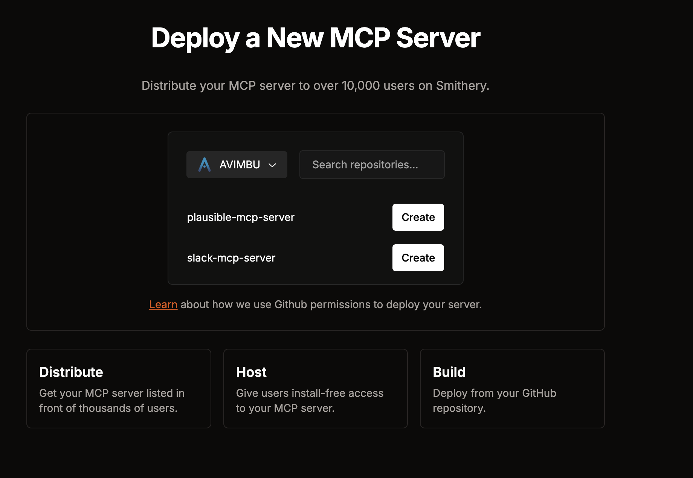
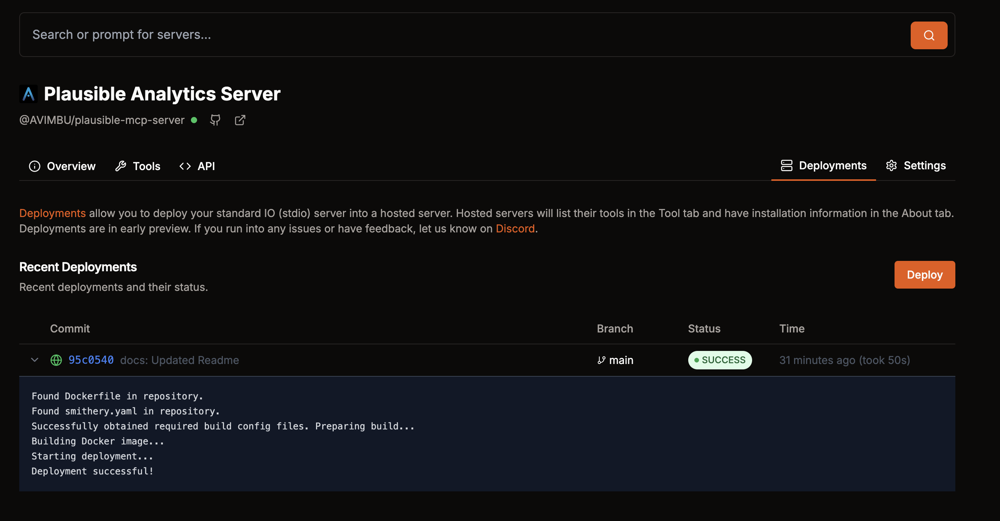

# Creating a Model Context Protocol Server: A Step-by-Step Guide

In this guide, we'll walk through creating a Model Context Protocol (MCP) server from scratch. We'll use the Plausible Analytics API as our example, but the principles can be applied to any API you want to make accessible to AI models. Additionally, we will explain the process of deploying the MCP Server. For this, we use [smithery.ai](https://smithery.ai/). 

## What is a Model Context Protocol Server?

A Model Context Protocol server acts as a bridge between AI models (like Claude) and external APIs or services. It provides a standardized way for AI models to interact with these services through well-defined tools and interfaces. If you want to learn more about it, head over to the [Official Reference Documentation:](https://modelcontextprotocol.io/introduction).

## Prerequisites

To follow this guide, you'll need:
- Node.js installed on your system
- Basic understanding of TypeScript
- Basic understanding of APIs and HTTP requests
- A Plausible Analytics API key (for this specific example)

## Project Setup

First, let's create a new project and install the necessary dependencies:

```bash
mkdir mcp-server
cd mcp-server
npm init -y
```

Update your `package.json` with the following configuration:

```json
{
  "name": "plausible-model-context-protocol-server",
  "version": "0.0.1",
  "description": "MCP Server for Plausible Analytics",
  "license": "MIT",
  "type": "module",
  "bin": {
    "mcp-plausible-server": "dist/index.js"
  },
  "files": [
    "dist"
  ],
  "scripts": {
    "build": "tsc && shx chmod +x dist/*.js",
    "prepare": "npm run build",
    "watch": "tsc --watch"
  },
  "dependencies": {
    "@modelcontextprotocol/sdk": "1.7.0",
    "@types/node": "^22"
  },
  "devDependencies": {
    "@types/node": "^22",
    "shx": "^0.3.4",
    "typescript": "^5.8.2"
  }
}
```

The key dependency here is `@modelcontextprotocol/sdk`, which provides the core functionality for creating an MCP server. You can read more about it [here](https://github.com/modelcontextprotocol/typescript-sdk). 

## TypeScript Configuration

Create a `tsconfig.json` file. This is necessary to tell the `tsc` (TypeScript Transpiler) how to handle the TypeScript code and transpile it into JavaScript code.

```json
{
  "compilerOptions": {
    "target": "es2020",
    "module": "es2020",
    "moduleResolution": "node",
    "outDir": "./dist",
    "rootDir": "./src",
    "strict": true,
    "esModuleInterop": true,
    "skipLibCheck": true,
    "forceConsistentCasingInFileNames": true
  },
  "include": ["src/**/*"],
  "exclude": ["node_modules", "dist"]
}
```

## Component-by-Component Implementation

In order to create a MCP server, a few components are necessary. We've split the logic into three main topics: API Client, Tool Definition and the MCP Server.

### 1. API Client (`src/plausible/client.ts`)

The API client handles the actual communication with the external service. It's responsible for making HTTP requests and handling responses. Here, you can add the actual interaction logic and handle requests and responses. 

```typescript
const PLAUSIBLE_API_URL = process.env.PLAUSIBLE_API_URL || "https://plausible.io/api/v2";
const PLAUSIBLE_API_KEY = process.env.PLAUSIBLE_API_KEY;

if (!PLAUSIBLE_API_KEY) {
  throw new Error("PLAUSIBLE_API_KEY environment variable is required");
}

class PlausibleClient {
  async query(siteId: string, metrics: string[], dateRange: string) {
    const response = await fetch(`${PLAUSIBLE_API_URL}/query`, {
      method: "POST",
      headers: {
        Authorization: `Bearer ${PLAUSIBLE_API_KEY}`,
        "Content-Type": "application/json",
      },
      body: JSON.stringify({
        site_id: siteId,
        metrics: metrics,
        date_range: dateRange,
      }),
    });

    if (!response.ok) {
      throw new Error(`Plausible API error: ${response.statusText}`);
    }

    return response.json();
  }
}

export const plausibleClient = new PlausibleClient();
```

Key points:
- Uses environment variables for configuration
- Implements API-specific methods (in this case, `query`)
- Handles errors appropriately
- Exports a singleton instance

### 2. Tool Definition (`src/plausible/query.ts`)

The tool definition describes how AI models can interact with your service. It follows the standards set by the Model Context Protocol [documentation](https://modelcontextprotocol.io/introduction).

```typescript
import { Tool } from "@modelcontextprotocol/sdk/types.js";

export interface QueryArgs {
  site_id: string;
  metrics: string[];
  date_range: string;
}

export const queryTool: Tool = {
  name: "plausible_query",
  description: "Query analytics data from Plausible",
  inputSchema: {
    type: "object",
    required: ["site_id", "metrics", "date_range"],
    properties: {
      site_id: {
        type: "string",
        description: "The domain of the site to query data for",
      },
      metrics: {
        type: "array",
        items: {
          type: "string",
        },
        description: "List of metrics to query (e.g., visitors, pageviews)",
      },
      date_range: {
        type: "string",
        description: "Date range for the query (e.g., '7d', '30d')",
      },
    },
  },
};
```

Key points:
- Defines the tool's interface using TypeScript
- Specifies required and optional parameters
- Provides clear descriptions for each parameter
- Uses JSON Schema for parameter validation

### 3. MCP Server (`src/index.ts`)

The main server file ties everything together. It's responsible for exposing the MCP server, handling incoming requests and responding accordingly. 

```typescript
#!/usr/bin/env node
import { Server } from "@modelcontextprotocol/sdk/server/index.js";
import { StdioServerTransport } from "@modelcontextprotocol/sdk/server/stdio.js";
import {
  CallToolRequest,
  CallToolRequestSchema,
  ListToolsRequestSchema,
} from "@modelcontextprotocol/sdk/types.js";
import { QueryArgs, queryTool } from "./plausible/query.js";
import { plausibleClient } from "./plausible/client.js";

const server = new Server(
  {
    name: "plausible-model-context-protocol-server",
    version: "0.0.1",
  },
  {
    capabilities: {
      tools: {},
    },
  }
);

server.setRequestHandler(ListToolsRequestSchema, async () => {
  return {
    tools: [queryTool],
  };
});

server.setRequestHandler(
  CallToolRequestSchema,
  async (request: CallToolRequest) => {
    try {
      if (!request.params.arguments) {
        throw new Error("Arguments are required");
      }

      switch (request.params.name) {
        case "plausible_query": {
          const args = request.params.arguments as unknown as QueryArgs;
          if (!args.site_id || !args.metrics || !args.date_range) {
            throw new Error("Missing required arguments");
          }
          const response = await plausibleClient.query(
            args.site_id,
            args.metrics,
            args.date_range
          );
          return {
            content: [{ type: "text", text: JSON.stringify(response) }],
          };
        }

        default:
          throw new Error(`Unknown tool: ${request.params.name}`);
      }
    } catch (error) {
      console.error("Error executing tool:", error);
      return {
        content: [
          {
            type: "text",
            text: JSON.stringify({
              error: error instanceof Error ? error.message : String(error),
            }),
          },
        ],
      };
    }
  }
);

async function runServer() {
  const transport = new StdioServerTransport();
  await server.connect(transport);
  console.error("Plausible MCP Server running on stdio");
}

runServer().catch((error) => {
  console.error("Fatal error in main():", error);
  process.exit(1);
});
```

Key points:
- Creates an MCP server instance
- Registers available tools
- Handles tool execution requests
- Uses stdio for communication
- Implements error handling

## How It All Works Together

In order to provide you with a complete picture, the following steps explain how everything works together: 

1. The AI model sends a request to execute a tool (e.g., `plausible_query`)
2. The request comes through `stdio` to your server
3. The server validates the request and its arguments
4. The appropriate tool handler is called
5. The tool uses the API client to make the actual request
6. The response is formatted and sent back to the AI model

## Using the Server

1. Build the server:
```bash
npm install
npm run build
```

2. Configure the environment:
```bash
export PLAUSIBLE_API_KEY=your-api-key
export PLAUSIBLE_API_URL=your-plausible-url
```

3. Run the server:
```bash
node dist/index.js
```

## Integration with Claude Desktop

In order to test the MCP server with an actual LLM AI model, [Claude Desktop](https://claude.ai/download) offers an option to test and run local MCP servers. This can be achieved by adding the following JSON block to the configuration of your Claude Desktop MCP Server config [file](https://modelcontextprotocol.io/quickstart/user):

```json
{
  "mcpServers": {
    "mcp-plausible-local": {
      "command": "node",
      "args": ["/path/to/project/dist/index.js"],
      "env": {
        "PLAUSIBLE_API_URL": "https://plausible.io/api/v2",
        "PLAUSIBLE_API_KEY": "your_api_key"
      }
    }
  }
}
```

## Best Practices

1. **Error Handling**: Always implement proper error handling and provide meaningful error messages.
2. **Type Safety**: Use TypeScript interfaces and type checking to catch errors early.
3. **Documentation**: Provide clear descriptions for your tools and their parameters.
4. **Environment Variables**: Use environment variables for configuration and sensitive data.
5. **Validation**: Validate all input parameters before making API calls.

## Deployment 

Currently, the process of deploying a Model Context Protocol Server is quite new in terms of how and where to deploy it to. One of the main players is [smithery.ai](https://smiterhy.ai), who provide a all in one solution for deploying and exploring MCP servers. In order to deploy the following implementation to [smithery.ai](https://smiterhy.ai), you need to ensure the following two things: 

- Your repository is publicly available.
- A smithery.yaml and a Dockerfile is available. 

Therefore, let's create the two files: 

```yaml
startCommand:
  type: stdio
  configSchema:
    type: object
    required:
      - plausibleAPIKey
      - plausibleAPIURL
    properties:
      plausibleAPIKey:
        type: string
        description: The API Key of your Plausible account.
      plausibleAPIURL:
        type: string
        description: The URL of your Plausible server, default to https://plausible.io/api/v2
  commandFunction:
    |-
    (config) => ({ command: 'node', args: ['dist/index.js'], env: { PLAUSIBLE_API_URL: config.plausibleAPIURL, PLAUSIBLE_API_KEY: config.plausibleAPIKey } })
```
Here, you can define the necessary properties and provide the startup command. 

Additionally, the Dockerfile tells [smithery.ai](https://smiterhy.ai) how to build the server: 

```Dockerfile
FROM node:23-alpine

WORKDIR /app

COPY . ./

# Install dependencies
RUN npm install

# Build the application
RUN npm run build

# Command will be provided by smithery.yaml
CMD ["node", "dist/index.js"]

```

Once these files are created, head over to [smithery.ai](https://smiterhy.ai), connect your GitHub account and hit the `Add Server` button. 



[smithery.ai](https://smiterhy.ai) will ask you to select the repository and once all is connected, you need to start a `Deployment`. Once thats done, your MCP server is live and findable via [smithery.ai](https://smiterhy.ai). 




## Conclusion

Creating an MCP server is a powerful way to extend AI models' capabilities by giving them access to external services. The key is to:
- Define clear interfaces for your tools
- Handle errors gracefully
- Provide good documentation
- Follow TypeScript best practices

With this guide, you should be able to create your own MCP server for any API or service you want to make accessible to AI models. You can find the repository of this guide [here](https://github.com/AVIMBU/plausible-mcp-server) and the deployed MCP server [here](https://smithery.ai/server/@AVIMBU/plausible-mcp-server).

---

For organizations looking to implement MCP in their AI solutions, our [agency](https://avimbu.com) specializes in developing custom MCP servers and integrations tailored to specific business needs. We help bridge the gap between your organization’s knowledge repositories and the AI systems your users interact with.

*Note: The Model Context Protocol is a rapidly evolving technology. The information in this article is current as of March 2025. For the most up-to-date information, please refer to the official MCP specification and documentation.*
